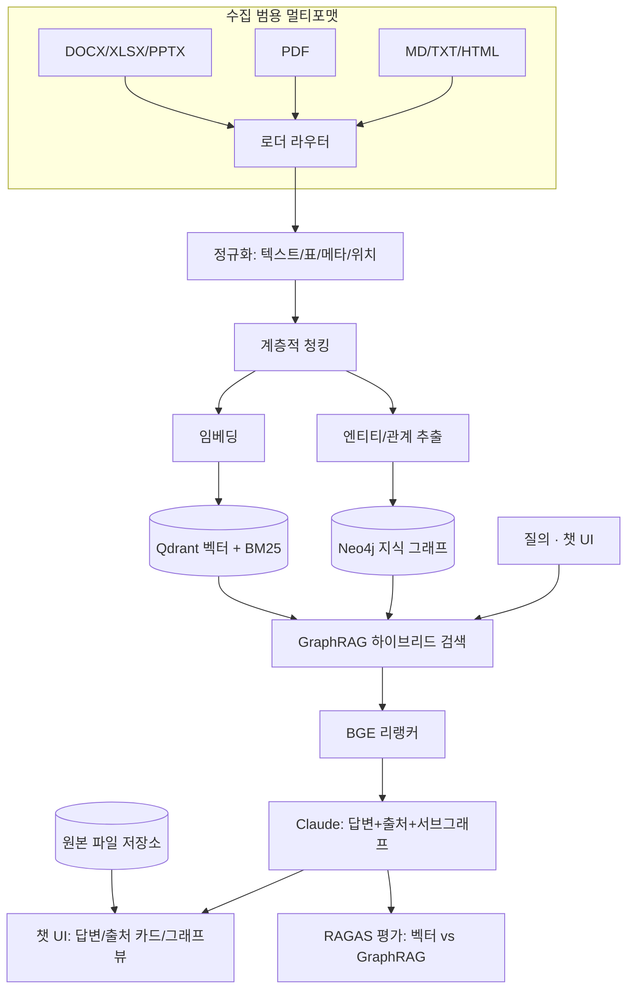

# GraphRAG 멀티포맷 문서 질의응답 시스템 개발 계획서

> **1인 개발 · 8주(2026-06-22 ~ 2026-08-16) · AI 포트폴리오 + 실무 도구 겸용**
> **핵심 전략:** 완벽함이 아니라 **"질문 → 답변 → 출처 표기·다운로드 + 근거 서브그래프 관통 데모 + 정량 평가(RAGAS)로 증명"**
> **설계 원칙:** 완주 > 기능 수. 미완성 거대 시스템 < 완주된 작은 증명. 범위 욕심을 컷하고 **단 하나의 킬러 수치** — "GraphRAG가 단순 벡터 RAG보다 멀티홉 질의에서 정확도 N% 향상" — 에 올인한다.

---

## 1. 프로젝트 개요

### 1.1 배경

- 사용자는 보고서·매뉴얼·명세·노트 등 **다양한 포맷의 문서**를 다루지만, 필요한 내용을 빠르게 찾고 근거와 함께 확인하기 어렵다.
- 양식이 고정된 특정 문서만 받는 시스템은 적용 범위가 좁다. 실무에서는 **MD·PDF·TXT·DOCX·XLSX·PPTX·HTML 등 임의 포맷**을 그대로 올려 바로 질의할 수 있어야 한다.
- 단순 문서 챗봇은 환각(Hallucination) 때문에 출처가 불명확하고, 평면 벡터 검색만으로는 여러 단계 관계를 따라가는 질문에 약하다.

### 1.2 목적

하나의 **GraphRAG 엔진**으로 임의 포맷 문서를 색인하고, **지식 그래프 + 벡터 하이브리드**로 검색하여, 자연어 질문에 대해 **업로드된 문서 내용을 근거로** 답변하고, **어떤 문서의 어느 부분**을 참고했는지 표기하며 **클릭 시 원본 파일을 다운로드**하는 고신뢰성 문서 질의응답 시스템을 구축한다.

### 1.3 차별화 포인트 (단순 RAG와의 구분선)

1. **GraphRAG 멀티홉 추론** — 단순 벡터 검색이 아니라 문서에서 추출한 엔티티·관계 그래프 기반으로 멀티홉 질의("A와 연관된 B의 처리 절차")를 지원한다. **이 프로젝트의 메인 무기.**
2. **출처 표기 + 다운로드** — 답변 근거를 문서명·위치(페이지/섹션)로 간략 표기하고, 클릭 시 원본 파일을 내려받게 한다.
3. **RAG 평가 자동화 루프** — RAGAS로 **벡터 RAG vs GraphRAG** 정확도·환각률을 정량 측정·개선한다.

> **포지셔닝:** "최신 기술 자랑"이 아니라 **"신뢰성 있게 돌아가는 것을 책임지고 만든 엔지니어"**. 측정하고 개선한 서사로 "구현자"가 아닌 "개선자"를 증명한다.

---

## 2. 해결하고자 하는 페인 포인트

| 페인 포인트 | 원인 | 본 시스템의 해결 |
| :--- | :--- | :--- |
| **포맷 제약** | 특정 양식만 받는 좁은 파이프라인 | 범용 멀티포맷 로더로 임의 포맷 자동 분기 처리 |
| **표(Table) 서식 붕괴** | 표를 무작위 크기로 청킹 | 표 인지(table-aware) 청킹으로 행·열 맥락 보존 |
| **환각·출처 불명** | 단순 벡터 RAG의 근거 부재 | 근거 없는 답변 거부 + 문서명·위치 표기 + 원본 다운로드 |
| **관계 추론 불가** | 평면 벡터 검색은 멀티홉 불가 | 지식 그래프 traversal로 멀티홉 추론 |
| **신뢰 검증 비용** | 답변 근거 원문 확인이 번거로움 | 출처 카드 클릭 한 번으로 원본 파일 확보 |

---

## 3. 시스템 아키텍처



**핵심 흐름:** 임의 포맷 문서를 로더 라우터가 자동 분기 → 공통 스키마로 정규화·청킹 → 엔티티/관계는 그래프 DB, 임베딩은 벡터 DB로 양방향 ID 연결 적재 → 질의 시 벡터+BM25+그래프 traversal을 융합하고 리랭커로 선별 → LLM이 출처·서브그래프와 함께 답변 → 원본 파일은 저장소에서 다운로드 제공 → RAGAS가 매주 품질을 측정한다.

---

## 4. 핵심 기능 요건

### 4.1 범용 멀티포맷 수집 `리스크: 중`

- **로더 라우터:** 확장자/MIME로 자동 분기.
  - `PDF → PyMuPDF`: 텍스트/표/페이지 위치 추출.
  - `DOCX/XLSX/PPTX/HTML/EML/이미지 → Unstructured`: 포맷별 텍스트·표 추출.
  - `MD/TXT → 텍스트 파서`: 헤딩/섹션 단위 분할.
- **표 인지 청킹:** 표는 행·열 맥락이 끊기지 않도록 단위 보존.
- **위치 메타 보존:** 포맷별 위치(`page`/`section`/`offset`)를 메타로 끝까지 보존 → 출처 표기·다운로드 연동의 기반.
- **현실 전략:** 파인튜닝 금지, 사전학습 모델 추론 우선. 파싱 완벽주의 금지, 대표 포맷부터 단계 확장.

### 4.2 지식 그래프 구축 (열린 스키마) `리스크: 중상 (함정 구간)`

- `SchemaLLMPathExtractor`로 엔티티/관계를 추출하되, **고정 도메인 타입을 강제하지 않고** 문서에서 나타나는 엔티티·관계를 동적으로 추출(필요 시 선택적 스키마 힌트로 환각 억제).
- **노드:** 문서에 등장한 엔티티(개념·항목·개체). **엣지:** 추출된 관계 타입(포함·인과·참조·연관 등).
- 그래프 노드에 출처(`doc_id`/`location`/`chunk_id`) 역링크 저장 → 그래프-벡터 양방향 ID 연결.
- 추출 품질이 낮으면 룰 기반으로 보강.

### 4.3 하이브리드 검색 & 리랭킹 `리스크: 낮음 (안전지대)`

- **벡터(의도)** + **BM25(키워드·코드·고유명사)** + **그래프 traversal(관계)** 융합.
- retriever: 벡터/BM25 top-k → 시드 노드 → **그래프 멀티홉 확장** → **BGE-Reranker** 선별.
- **질의 라우팅:** 단순 사실(벡터 우선) vs 관계 추론(그래프 우선) 자동 분기.

### 4.4 출처 표기 + 원본 다운로드 `★ 핵심 차별화`

- 답변 근거를 **문서명 + 위치(페이지/섹션) + 스니펫** 카드로 우측 패널에 간략 표기.
- **카드 클릭 시 원본 파일 다운로드**(백엔드 저장소에서 제공).
- **그래프뷰(P1):** react-force-graph로 답변 근거 서브그래프 표시, 노드 클릭 시 원문 출처 점프.
- **환각 제어:** 근거가 없는 답변은 거부한다.

### 4.5 RAG 평가 자동화 `★ 킬러 수치`

- 평가셋(질문-정답-출처: 멀티홉 10 + 단순 10 = 20문항)을 W1~W2에 선구축하여 **매주 측정**.
- RAGAS/DeepEval로 **Hit Rate, MRR, 환각률, 응답속도** 측정.
- **벡터 RAG vs GraphRAG 비교 측정**으로 멀티홉 질의 정확도 향상폭을 수치로 증명 → 면접 핵심 무기.
- 측정 → 개선(청킹/추출/리랭커/프롬프트) → 재측정 루프를 **의사결정 로그**로 문서화.

### 4.6 챗 UI (ChatGPT/Gemini 스타일)

- **3분할 반응형 그리드:** 사이드바(새 대화·세션 기록·문서 목록) + 메인 대화 영역 + 출처/그래프 패널.
- **메인 대화:** 말풍선 스택, 마크다운/코드 렌더링 + 메시지별 복사 버튼, 멀티라인 입력(`Enter` 전송 / `Shift+Enter` 줄바꿈), 📎 파일 첨부.
- **스트리밍 출력:** SSE 토큰 단위 타이핑 효과.
- **문서 업로드 → 즉시 질의:** 멀티포맷 드래그 앤 드롭 → 자동 인덱싱 → 진행률·상태 뱃지 → 바로 질문.
- 다크/라이트 모드, 빈 상태(Empty State) 안내 + 예시 질문 칩.

---

## 5. 기술 스택 (택1 결정 완료 — 면접 방어용)

| 영역 | 선정 | 비고 / 결정 사유 |
| :--- | :--- | :--- |
| RAG 엔진 | **LlamaIndex** (`PropertyGraphIndex`) | LangChain 병기 X. 그래프+벡터 인덱스 통합, 멀티포맷 로더 풍부 |
| 그래프 DB | **Neo4j** | Cypher 멀티홉 traversal, 시각화 용이, LlamaIndex 통합 성숙 |
| 벡터 DB | **Qdrant** | 메타 필터(`doc_type`/`location`) 강력, 1인 PoC에 경량 |
| 키워드 검색 | **BM25** | 키워드·코드·고유명사에 강함 |
| 리랭커 | **BGE-Reranker** | 벡터+그래프+BM25 결과 재정렬 |
| 임베딩 | **OpenAI text-embedding-3-small** | 시맨틱 포착 정교 |
| 멀티포맷 로더 | **Unstructured**(MD/DOCX/XLSX/PPTX/HTML/EML/이미지) + **PyMuPDF**(PDF) | 포맷별 자동 분기, 표 추출 |
| 엔티티/관계 추출 | **LlamaIndex `SchemaLLMPathExtractor`** (열린 스키마) | 동적 추출, 선택적 스키마로 환각 억제 |
| LLM | **Claude 단일** | 답변·추출 전부 담당. 이중 LLM 폐기로 비용·복잡도·면접 빈틈 제거 |
| 백엔드 | **FastAPI** (Python) + PostgreSQL + 파일 저장소 | 표준·검증됨, 세션/문서 메타 + 원본 파일 보관 |
| 프론트엔드 | **Next.js + TypeScript, Tailwind CSS, shadcn/ui** | 챗 UI + 출처 카드 |
| 상태 관리 | **Zustand / React Query** | 세션·서버 응답 캐싱 경량화 |
| 마크다운 렌더 | **react-markdown + react-syntax-highlighter** | 코드/표 안전 렌더·구문 강조 |
| 그래프 시각화 | **react-force-graph** | 근거 서브그래프 표시 (★ 여유 시) |
| 스트리밍 | **SSE (Server-Sent Events)** | 토큰 단위 타이핑 |
| 평가 | **RAGAS / DeepEval** | Hit Rate, MRR, 환각률, 응답속도 |
| 인프라 | **Docker Compose** | FastAPI + Qdrant + Neo4j + PostgreSQL 일괄 기동 |

> **택1 근거(면접 대비):** RAG 엔진 → LlamaIndex 단일. 벡터 DB → Qdrant(Milvus는 대규모 클러스터용이라 제외). LLM → Claude 단일(이중 LLM 폐기로 "왜 둘?" 질문 차단).
> **검증 UI:** W5 백엔드 완성 전까지 품질 검증은 **Streamlit + Neo4j Browser**로. 본 제품 UI는 W6부터 Next.js.

---

## 6. 데이터 모델

### 6.1 통합 메타데이터 스키마

```
공통:  doc_id, doc_name, doc_type(md|pdf|txt|docx|xlsx|pptx|html…), source, score, chunk_id
위치:  location(page | section | offset)   # 포맷별 의미: PDF=page, MD/HTML=section, TXT=offset
원본:  file_path, download_url              # 원본 파일 다운로드용
```

### 6.2 그래프 스키마 (열린 스키마)

- **노드(엔티티):** 문서에서 동적으로 추출된 엔티티(개념·항목·개체). 고정 도메인 타입 강제 X.
- **엣지(관계):** 추출된 관계 타입(포함·인과·참조·연관 등).
- **출처 역링크:** 모든 노드는 `doc_id`/`location`/`chunk_id`를 보존하여 벡터 청크와 양방향 연결.

---

## 7. API 계약 (FastAPI / SSE)

```
POST   /api/upload               # 문서 업로드 → 원본 저장 + 인덱싱 큐(로더 자동분기), job_id 반환
GET    /api/documents            # 문서 목록 + 인덱싱 상태 + 포맷
GET    /api/documents/:id/download  # 원본 파일 다운로드
POST   /api/chat                 # { query, session_id } → SSE 답변 + sources + subgraph
GET    /api/graph                # 서브그래프 노드/엣지 조회(시각화용)
GET    /api/sessions             # 대화 세션 목록
DELETE /api/sessions/:id         # 세션 삭제
```

`/api/chat` SSE 이벤트 예시:

```json
{ "type": "token",    "content": "결론은 ..." }
{ "type": "sources",  "data": [ { "doc_id": "d1", "doc_name": "report.pdf", "doc_type": "pdf", "location": "p.12", "snippet": "…", "score": 0.92, "download_url": "/api/documents/d1/download" } ] }
{ "type": "subgraph", "data": { "nodes": [..], "edges": [..] } }
{ "type": "done" }
```

---

## 8. 단계별 로드맵 (8주) — 관통 데모 W3 전진 배치

> 시작 2026-06-22(월). 주차 = 월~일. 각 주 끝 **검증 게이트(Gate)** 통과해야 다음 진입. **P0 = 무조건 완성, P1 = 여유 시.**

### W1 · 설계 + PoC + 평가셋 착수 (06/22 ~ 06/28)
- 아키텍처·메타·그래프 스키마 확정.
- Docker Compose 골격(FastAPI + Qdrant + Neo4j + PostgreSQL) + 원본 파일 저장소.
- **PoC ①** 멀티포맷: Unstructured/PyMuPDF로 PDF·DOCX·MD 각 1개 텍스트/표/위치 추출 검증. **PoC ②** 표 인지 청킹 1건. **PoC ③** 샘플 텍스트 → Claude 엔티티/관계 추출 → Neo4j 1건 적재.
- **평가셋 P0:** 멀티홉 5 + 단순 5 골격(질문-정답-출처) 작성 시작.
- **🎯 Gate 1:** 3개 포맷 로딩 + 위치 메타 보존 OK + Neo4j 노드/엣지 1건 시각화 OK + 평가셋 10문항 초안.

### W2 · 수집 파이프라인 + 평가셋 완성 (06/29 ~ 07/05)
- 로더 라우터(확장자/MIME 분기: PDF→PyMuPDF, 그 외→Unstructured, MD/TXT→텍스트 파서).
- 공통 정규화(텍스트/표/메타/위치) + 계층적·표 인지 청킹. Qdrant 적재 + BM25 인덱스. 원본 파일 저장 + `download_url` 연결.
- **평가셋 P0 완성:** 멀티홉 10 + 단순 10 = 20문항 고정(매주 측정 기준).
- **🎯 Gate 2:** 4종 이상 포맷이 동일 파이프라인으로 Qdrant 적재 + 다운로드 링크 동작. 평가셋 20문항 확정.

### W3 · 지식 그래프 구축 + ★관통 데모 (07/06 ~ 07/12) ⚠️ 함정 + 핵심
- `SchemaLLMPathExtractor`로 엔티티/관계 추출(열린 스키마, 환각 억제).
- **위치 메타 끝까지 전파**, 그래프 노드에 출처 역링크, 그래프-벡터 양방향 ID 연결.
- **관통(P0):** Streamlit에서 질문→하이브리드 검색→Claude 답변→출처 표기. 거칠어도 end-to-end 연결.
- **리스크:** 관계 추출은 과소추정 단골. 완벽주의 금지 — 핵심 관계만, 품질 낮으면 룰기반 보강.
- **🎯 Gate 3:** "A → 연관 B → 처리 절차" 멀티홉 Cypher 동작 + **관통 데모 1회 성공**. 노드 출처 메타 보존.

### W4 · 하이브리드 검색 고도화 + ★킬러 수치 1차 (07/13 ~ 07/19)
- 하이브리드 retriever(벡터/BM25 top-k → 시드 노드 → 그래프 멀티홉 확장 → BGE 리랭커).
- 질의 라우팅(단순 사실 vs 관계 추론), 환각 제어(근거 없는 답변 거부), 답변에 sources + 서브그래프 동봉.
- **★ 1차 비교 측정:** 평가셋 20문항에 벡터 RAG vs GraphRAG 각각 RAGAS 측정, 멀티홉 향상폭 첫 숫자 확보.
- **🎯 Gate 4:** Streamlit 관통 안정 + **벡터 vs GraphRAG 비교표 1차 산출**.

### W5 · FastAPI 백엔드 API (07/20 ~ 07/26)
- GraphRAG 엔진을 REST/SSE로 노출(7장 엔드포인트 계약), 비동기 인덱싱 큐(포맷 자동분기), 원본 다운로드 엔드포인트, PostgreSQL 세션/문서 메타.
- **🎯 Gate 5:** curl/Postman으로 업로드→인덱싱→chat SSE(sources+subgraph)+다운로드 정상.

### W6 · 프론트엔드 챗 UI (07/27 ~ 08/02)
- Next.js + Tailwind + shadcn/ui, 3분할 그리드(사이드바/대화/출처). 말풍선, 멀티라인 입력, 마크다운·코드 렌더 + 복사. `/api/chat` SSE 토큰 타이핑.
- **🎯 Gate 6:** 브라우저 질문→스트리밍 답변→마크다운 렌더 정상.

### W7 · 출처 카드+다운로드(P0) + 그래프뷰(P1) + 업로드/세션 (08/03 ~ 08/09) ★ 핵심 차별화
- **P0 — 출처 패널:** 답변 근거 문서명·위치·스니펫 카드 표기 + **카드 클릭 시 원본 다운로드**.
- **P0 — 업로드/세션:** 멀티포맷 드래그앤드롭 + 인덱싱 진행률 폴링, 사이드바 문서 목록(포맷 뱃지), 세션 저장·전환·삭제, 다크모드.
- **P1 — 그래프뷰:** react-force-graph 서브그래프, 노드 클릭→원문 점프. **시간 없으면 과감히 컷.**
- **🎯 Gate 7:** 답변 출처 카드 표기 + 클릭 다운로드 동작.(그래프뷰는 가산점)

### W8 · ★킬러 수치 확정 + Docker + 마감 (08/10 ~ 08/16)
- **★ 최종 비교 측정:** 개선 후 재측정 1회전, **벡터 RAG vs GraphRAG 최종 지표표**(Hit Rate, MRR, 환각률, 응답속도).
- 의사결정 로그 문서화, Docker Compose 전체 패키징, 멀티포맷 E2E QA, README + 지표표 + 트레이드오프 로그 + 관통 데모 영상/캡처.
- **🎯 Gate 8(최종):** Docker 원클릭 기동, **벡터 vs GraphRAG 비교 지표표 완성**, 관통 데모 영상.

---

## 9. 마일스톤 요약

| 주차 | 기간 | 단계 | 핵심 산출물 (Gate) |
| :--- | :--- | :--- | :--- |
| W1 | 06/22~06/28 | 설계+PoC+평가셋 | 스키마, 멀티포맷·청킹·그래프 PoC, 평가셋 초안 |
| W2 | 06/29~07/05 | 수집+평가셋 | 멀티포맷 로더+정규화+Qdrant+다운로드, 평가셋 20문항 확정 |
| W3 | 07/06~07/12 ⚠️★ | 그래프+관통 | 멀티홉 Cypher + **관통 데모 1회** |
| W4 | 07/13~07/19 ★ | 검색+킬러 1차 | **벡터 vs GraphRAG 비교표 1차** |
| W5 | 07/20~07/26 | 백엔드 API | FastAPI+SSE(sources+subgraph)+다운로드 |
| W6 | 07/27~08/02 | 챗 UI | 스트리밍 대화 화면 |
| W7 | 08/03~08/09 ★ | 출처카드+다운로드(P0)+그래프뷰(P1) | 출처 표기 + 클릭 다운로드 + 업로드/세션 |
| W8 | 08/10~08/16 ★ | 킬러 수치+배포 | **최종 비교 지표표 + Docker + 마감** |

---

## 10. 리스크 관리

- **함정 구간 W3(그래프 추출):** 관계 추출은 과소추정 단골 = 최대 리스크. 관계 타입·대상 문서 범위 축소, 품질 낮으면 룰기반 보강. **W3에 관통 데모 포함 = 지연 시에도 end-to-end 1개는 확보.**
- **관통 우선 원칙:** 품질보다 W3 end-to-end 먼저. 깊이는 그 후. 빈말 아니라 일정에 박았다.
- **1인 8주 미완성 리스크:** "다 구현" 금지. P0/P1 분리로 관리, P1(그래프뷰)은 언제든 컷. **킬러 수치(P0)는 절대 사수.** MVP 관통 데모 + GraphRAG 비교 지표 + 의사결정 로그가 "거대하지만 미완성"보다 우위.
- **GraphRAG 비용:** Claude 엔티티 추출 비용↑ → 대상 문서 수 제한, 추출 결과 캐싱.
- **병렬화:** W5 API 계약 확정 후 W6 프론트/백 병렬.
- **버퍼:** W8 후반 2~3일 안정화/문서 고정, 신규 기능 금지.

---

## 11. 기대 효과

### 정성
- 흩어진 다양한 포맷 문서를 한 곳에서 자연어로 검색·확인.
- 답변 근거를 문서명·위치로 즉시 표기하고 원본까지 한 번에 확보 → 신뢰성·검증 속도 향상.
- 멀티홉 관계 질의로 단순 키워드 검색이 놓치는 연관 정보 회수.

### 정량 (포트폴리오 증명 지표)
- RAG 정확도: **Hit Rate, MRR**
- 신뢰성: **환각률(%) 감소폭**
- 성능: **평균 응답속도(s)**
- 차별화: **벡터 RAG 대비 GraphRAG 멀티홉 정확도 향상폭(%)**

> 막연한 "단축"이 아니라 **본인 시스템의 측정값·개선폭**으로 제시한다.

---

## 12. 포트폴리오 어필 포인트 (4년차 차별화)

> 면접 무기는 적고 깊어야 강하다. 핵심 3개에 집중한다.

1. **★ GraphRAG vs 벡터 멀티홉 비교 수치** — 최신 기술을 도입에 그치지 않고 정량 검증. "구현자 아닌 개선자"의 핵심 증거. **메인 무기.**
2. **범용 멀티포맷 처리** — MD/PDF/DOCX/XLSX/PPTX/HTML 등 단일 엔진 처리 → 실무 적용 범위 어필.
3. **출처 표기 + 원본 다운로드** — 답변 신뢰성 검증을 한 번의 클릭으로, 단순 문서 챗봇과 결정적 차별선.

**보조 (질문 받으면 방어):** 트레이드오프 의사결정 로그(스택 택1 사유), Docker 4서비스 패키징, RAGAS 자동 평가 루프(MLOps 인상).

---

## 13. 라이선스

본 프로젝트는 MIT 라이선스에 따라 배포된다.
