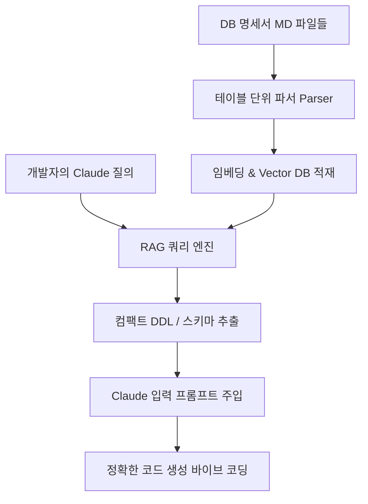

# DB 명세서 특화 RAG 개발 계획서 (개발자/Claude 연동용)

본 계획서는 여러 개의 대용량 **DB 명세서(Markdown 형식)**를 효율적으로 RAG로 구축하여, **Claude 등 AI 코딩 어시스턴트에게 필요한 컨텍스트(테이블 스키마, 컬럼 정보)만 정밀하게 추출·전달**하기 위한 특화 시스템 구축 기획안입니다.

---

## 1. 해결하고자 하는 페인 포인트 (Pain Point)

* **과도한 토큰 소모 & 비용**: 수십~수백 개의 테이블 명세서를 Claude 프롬프트에 통째로 넣으면 토큰 한도를 초과하거나 비용이 기하급수적으로 증가함.
* **컨텍스트 유실 (Lost in the Middle)**: 명세서가 너무 길면 Claude가 특정 테이블이나 컬럼의 데이터 타입을 오인하거나 누락하여 잘못된 코드를 생성함 (바이브 코딩의 생산성 저하).
* **표(Table) 서식 붕괴**: 마크다운 표 형식의 명세서를 무작위 크기로 청킹하면 행과 열의 맥락이 끊겨 검색 정확도가 현저히 떨어짐.

---

## 2. 핵심 설계 및 해결 전략 (Key Architecture)



### 2.1 테이블 단위의 의미적 청킹 (Semantic Table-Level Chunking)
* **테이블 1개 = 1개의 청크**: 명세서에서 테이블 정의(`### 테이블명: users` 등)별로 하나의 청크로 완전히 독립시켜 분할합니다. 표 중간에서 텍스트가 잘리는 현상을 완벽히 방지합니다.
* **메타데이터 강제 주입**: 각 청크에 `table_name`, `logical_name`(한글 테이블명), `related_tables`(외래키 관계)를 메타데이터 필드로 주입하여 검색 가중치를 부여합니다.

### 2.2 LLM 최적화 스키마 포맷 변환 (Markdown Table → SQL DDL)
* RAG 검색 결과로 마크다운 표 형식을 그대로 Claude에게 넘기면 불필요한 마크업 토큰(줄바꿈, 파이프 기호 `|`, 공백 등)이 낭비됩니다.
* 검색된 스키마 청크를 **압축된 SQL DDL 문태(e.g., `CREATE TABLE users (...)`)**로 변환하여 Claude에게 전달합니다. 
* **효과**: 토큰 소모량을 **최대 50% 이상 절감**하며, Claude가 데이터 타입과 PK/FK 관계를 훨씬 명확히 이해합니다.

### 2.3 약어 사전(Abbreviation Glossary) 매핑 검색
* 현업 DB 스키마는 `cust_no` (고객번호), `reg_dt` (등록일자) 등 축약어를 흔히 사용합니다.
* 검색 쿼리에서 "등록일자 컬럼이 있는 테이블 찾아줘"라고 했을 때 `reg_dt`를 찾아낼 수 있도록, 동의어/약어 사전 메타데이터 필터를 적용하거나 임베딩 매칭력을 보강합니다.

---

## 3. 추천 기술 스택 (개발 생산성 및 연동 중심)

| 영역 | 기술 스택 | 선정 이유 |
| :--- | :--- | :--- |
| **Parsing & Chunking** | `Python`, `LlamaIndex` | 마크다운 표 요소를 JSON/Object 구조로 정밀하게 읽어들이는 Parser 모듈 제공 |
| **Vector DB** | `ChromaDB` (로컬) | 설치와 관리가 쉽고, 컬럼명/테이블명 메타데이터 기반 필터링(filtering) 연산 속도가 매우 빠름 |
| **Embedding** | `OpenAI text-embedding-3-small` | 약어와 영어 컬럼명의 시맨틱 연관 관계를 가장 정교하게 포착 |
| **CLI / Web UI** | `Python CLI` 또는 `Streamlit` | **IDE(VS Code, Cursor 등) 옆에 두고 빠르게 테이블을 검색하여 복사할 수 있는 CLI 도구** 혹은 Streamlit 챗창 구축 |

---

## 4. 단계별 구축 로드맵 (2주 완성 초단기 MVP)

### **[1주차] 명세서 파싱 및 데이터 적재 파이프라인 (Data Pipeline)**
* **1일차**: 마크다운 DB 명세서 포맷 분석 및 테이블 단위 분할 스크립트 작성.
* **2~3일차**: 추출된 테이블 정보를 바탕으로 (1) 임베딩용 요약 텍스트, (2) Claude 전송용 DDL, (3) 메타데이터(테이블명, 한글명)를 자동 생성하는 클래스 구현.
* **4~5일차**: ChromaDB 연동 및 테이블 정보 적재, 키워드(BM25) + 벡터(Vector) 하이브리드 검색 구현.

### **[2주차] 검색 최적화 및 Claude 연동 인터페이스 (Integration)**
* **6~7일차**: 약어 대응을 위한 동의어 매핑 및 검색 쿼리 파인 튜닝. "특정 테이블명 + 외래키로 엮인 테이블들"을 함께 묶어서 가져오는 **관계 기반 연관 검색** 구현.
* **8~9일차**: 개발자가 복사하기 편한 형태로 스키마 DDL 리스트를 출력하는 CLI 도구 또는 Streamlit 웹 인터페이스 개발 (클립보드 복사 버튼 내장).
* **10일차**: 실제 프로젝트 코드 작성 시 Claude에 주입해보며 토큰 소모량 및 코드 생성 정확도 벤치마킹.

---

## 5. 핵심 개발 가이드 (Code Outline 예시)

```python
# LlamaIndex 등을 활용한 테이블 전처리 예시
def parse_db_specification(file_path):
    # 1. 파일에서 '### 테이블명' 단위로 분할
    # 2. Markdown 표 데이터를 파싱하여 컬럼, 타입, 설명 추출
    # 3. 임베딩 벡터용 Text 생성 및 Claude용 압축 DDL 생성
    pass

# Claude에게 넘겨줄 프롬프트 템플릿 예시
"""
너는 우리 시스템의 DB 스키마를 참고하여 코드를 작성하는 개발자야.
아래 질문에 답변할 때 제공되는 관련 테이블들의 DDL을 참고해줘.

[참고 테이블 DDL]
{retrieved_ddls}

[질문/작업 지시]
{user_query}
"""
```

---

## 6. 다음 단계 제안 (Next Action)

현재 직면하신 토큰 낭비 문제를 해결하기 위해, 먼저 **DB 명세서 마크다운 파일의 실제 예시 포맷**을 몇 줄 확인하면 맞춤형 파서를 즉시 작성할 수 있습니다. 

1. DB 명세서 md 파일 중 테이블 1~2개 분량의 텍스트 양식을 공유해 주실 수 있나요?
2. 검색된 스키마 정보를 **CLI 환경(터미널)에서 바로 조회/복사**하여 코딩에 사용하고 싶으신지, 아니면 **웹 브라우저 화면(Streamlit)**에서 조회하는 것을 선호하시는지 알려주세요!
