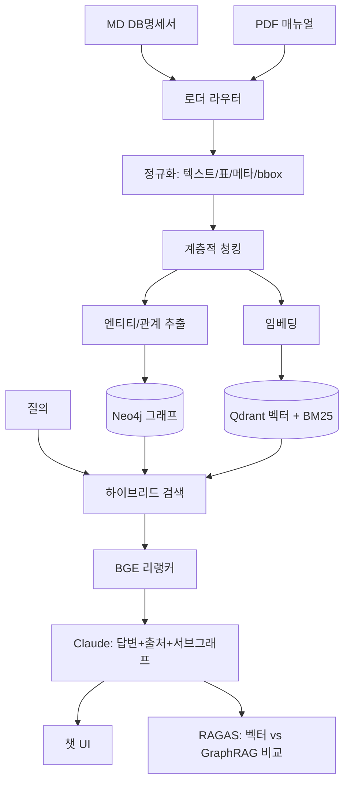

# 통합 GraphRAG 지식 관리 시스템 개발 계획서 (축소판)

> **1인 개발 · 8주(2026-06-22 ~ 2026-08-16) · 포스코DX 이직용 포트폴리오**
> **핵심 전략:** 범위 욕심 컷. **단 하나의 킬러 수치**에 올인 — "GraphRAG가 단순 벡터 RAG보다 멀티홉 질의에서 정확도 N% 향상"을 **정량 증명**한다.
> **설계 원칙:** 완주 > 기능 수. 미완성 거대 시스템 < 완주된 작은 증명.

이 축소판은 원안(`통합_하이브리드_RAG_지식관리시스템_개발계획서.md`) 대비 5개 결정으로 범위를 절반 잘랐다.

| # | 원안 | 축소판 결정 | 이유 |
| :--: | :--- | :--- | :--- |
| 1 | 멀티포맷 7종(MD/PDF/DOCX/XLSX/PPTX/HTML/TXT) | **MD + PDF 2종만** | 7종은 각자 단독 프로젝트급. 도메인(설비매뉴얼=PDF, DB명세서=MD)에 필요한 2종이면 충분 |
| 2 | Solar + Claude 이중 LLM | **Claude 단일** | 이중 = 비용·복잡도·면접 빈틈("왜 둘?"). 하나로 방어 단순화 |
| 3 | 기능 6개 동등 어필 | **킬러 1개 올인**(GraphRAG vs 벡터 비교 수치) | 나머지는 조연. 면접 무기는 하나로 충분 |
| 4 | 관통 데모 W4 | **W3로 당김** | end-to-end 먼저 = 미완성 보험. 깊이는 그 후 |
| 5 | 평가셋 W8 구축 | **W1~W2 선구축** | W8 몰빵 = 평가 부실 위험. 미리 만들어 매주 측정 |

---

## 1. 비전 (축소)

설비 매뉴얼(PDF) + DB 명세서(MD) 두 소스를 하나의 GraphRAG 엔진으로 색인하고, **지식 그래프 + 벡터 하이브리드**로 검색한다. 단순 벡터 RAG 대비 멀티홉 추론 우위를 수치로 증명한다.

- **2종 수집:** PDF(PyMuPDF, bbox 보존) + MD(테이블 단위 청킹).
- **지식 그래프:** 엔티티(Equipment, Part, ErrorCode, Table, Column) + 관계(HAS_PART, CAUSES, FIXED_BY, FK_TO) → 멀티홉 질의("에러코드 E-12 연관 부품의 점검 절차").
- **하이브리드 검색:** 벡터(의도) + BM25(코드/번호) + 그래프 traversal(관계) + BGE 리랭커.
- **출처 증명:** PDF bbox 하이라이트 + 근거 서브그래프 시각화.
- **킬러 수치:** RAGAS로 **벡터 RAG vs GraphRAG** 멀티홉 정확도 비교.



---

## 2. 기술 스택 (택1 완료 — 면접 방어용)

| 영역 | 선정 | 사유 |
| :--- | :--- | :--- |
| RAG 엔진 | **LlamaIndex** (`PropertyGraphIndex`) | 그래프+벡터 통합, 멀티포맷 로더 |
| 그래프 DB | **Neo4j** | Cypher 멀티홉, 시각화 용이 |
| 벡터 DB | **Qdrant** | 메타 필터(doc_type/bbox) 강력, 1인 PoC 경량 |
| 키워드 | **BM25** | 설비코드·에러번호·영문 컬럼명 |
| 리랭커 | **BGE-Reranker** | 벡터+그래프+BM25 재정렬 |
| 임베딩 | **OpenAI text-embedding-3-small** | 약어/영문 시맨틱 |
| 로더 | **PyMuPDF**(PDF bbox) + **MD 테이블 파서** | 2종 전용, 군더더기 X |
| 엔티티 추출 | **LlamaIndex `SchemaLLMPathExtractor`** | 스키마 제약으로 환각 억제 |
| **LLM** | **Claude 단일** | 답변·추출·코딩 컨텍스트 전부. 이중 LLM 폐기 |
| 백엔드 | **FastAPI** + PostgreSQL | 세션/문서 메타 |
| 프론트 | **Next.js + TS, Tailwind, shadcn/ui, PDF.js** | 챗 UI + bbox 하이라이트 |
| 그래프 뷰 | **react-force-graph** | 서브그래프 (★ 시간 남을 때만) |
| 스트리밍 | **SSE** | 토큰 타이핑 |
| 평가 | **RAGAS** | Hit Rate, MRR, 환각률, 응답속도 |
| 인프라 | **Docker Compose** | FastAPI+Qdrant+Neo4j+PostgreSQL |

> **검증 UI:** W5 백엔드 전까지 **Streamlit + Neo4j Browser**로 품질 확인. 본 UI는 W6부터 Next.js.

---

## 3. 로드맵 (8주) — 관통 데모 W3로 전진 배치

> 시작 2026-06-22(월). 각 주 끝 **Gate** 통과 후 진입. **MVP 우선순위(P0) 표시 = 무조건 완성. P1 = 여유 시.**

### W1 · 설계 + PoC + 평가셋 착수 (06/22~06/28)
- **목표:** 아키텍처·스키마 확정, 3대 PoC, **평가셋 골격 시작**.
- 작업:
  - 메타 스키마: 공통(`doc_id`,`doc_type`,`source`,`score`) + MD(`table_name`,`related_tables`) + PDF(`page`,`bbox`).
  - 그래프 스키마: 엔티티(Equipment,Part,ErrorCode,Table,Column) + 관계(HAS_PART,CAUSES,FIXED_BY,HAS_COLUMN,FK_TO).
  - Docker Compose 골격(FastAPI+Qdrant+Neo4j+PostgreSQL).
  - **PoC ①** PyMuPDF: PDF 1p 텍스트+bbox JSON 보존. **PoC ②** MD 테이블 1개 청킹. **PoC ③** 샘플 텍스트 → Claude 엔티티/관계 추출 → Neo4j 1건.
  - **평가셋 P0:** 멀티홉 질문 5개 + 단순 질문 5개 골격(질문-정답-출처) 작성 시작.
- **🎯 Gate 1:** PDF bbox 보존 OK + MD 청킹 OK + Neo4j 노드/엣지 1건 시각화 OK + 평가셋 10문항 초안.

### W2 · 수집 파이프라인 + 평가셋 완성 (06/29~07/05)
- **목표:** 2종 로더 + 정규화 + 청킹 + Qdrant 적재 + **평가셋 확정**.
- 작업:
  - 로더 라우터: 확장자 분기(MD→테이블 파서, PDF→PyMuPDF+bbox).
  - MD: `### 테이블명`=1청크, (1)임베딩 요약 (2)압축 DDL (3)메타 자동생성. 약어 사전(`reg_dt`↔등록일자).
  - 공통 정규화(텍스트/표/메타/bbox) + 계층적 청킹. Qdrant 적재 + BM25 인덱스.
  - **평가셋 P0 완성:** 멀티홉 10 + 단순 10 = 20문항 고정. 이게 매주 측정 기준.
- **🎯 Gate 2:** MD+PDF 동일 파이프라인으로 Qdrant 적재. 평가셋 20문항 확정.

### W3 · 그래프 구축 + ★관통 데모 (07/06~07/12) ⚠️ 함정 + 핵심
- **목표:** 엔티티/관계 추출 → Neo4j + bbox 보존 + **end-to-end 최초 관통**.
- 작업:
  - `SchemaLLMPathExtractor`로 추출(환각 억제). MD 외래키→`FK_TO`. PDF 설비-부품-에러코드→`HAS_PART`/`CAUSES`/`FIXED_BY`.
  - **bbox 좌표 끝까지 전파**, 그래프 노드에 출처(doc_id/page/bbox/chunk_id) 역링크.
  - 그래프-벡터 양방향 ID 연결.
  - **관통(P0):** Streamlit에서 질문→하이브리드 검색→Claude 답변→출처 표시. 거칠어도 end-to-end 연결.
- **리스크:** 추출+bbox 둘 다 과소추정 단골. **완벽주의 금지** — 핵심 관계 타입만, 품질 낮으면 룰기반 보강.
- **🎯 Gate 3:** "에러코드 E-12 → 연관 부품 → 점검절차" 멀티홉 Cypher 동작 + **관통 데모 1회 성공**. 노드 출처 메타 보존.

### W4 · 하이브리드 검색 고도화 + ★킬러 수치 1차 (07/13~07/19)
- **목표:** 검색 품질 끌어올리고 **벡터 vs GraphRAG 첫 비교 측정**.
- 작업:
  - 하이브리드 retriever: 벡터/BM25 top-k → 시드 노드 → 그래프 멀티홉 확장 → BGE 리랭커.
  - 질의 라우팅: 단순 사실(벡터 우선) vs 관계 추론(그래프 우선).
  - 환각 제어(출처 없는 답변 거부), 답변에 sources + 서브그래프 데이터 동봉.
  - **★ 1차 비교 측정:** 평가셋 20문항에 벡터 RAG vs GraphRAG 각각 RAGAS 측정. 멀티홉 향상폭 첫 숫자 확보.
- **🎯 Gate 4:** Streamlit 관통 안정 + **벡터 vs GraphRAG 비교표 1차 산출**(개선 여지 식별).

### W5 · FastAPI 백엔드 API (07/20~07/26)
- **목표:** 엔진을 REST/SSE로 노출, 프론트 병렬개발 가능.
- 엔드포인트:
  ```
  POST   /api/upload        # MD/PDF 업로드 → 인덱싱 큐, job_id
  GET    /api/documents     # 문서 목록 + 인덱싱 상태
  POST   /api/chat          # { query, session_id } → SSE 답변+sources+subgraph
  GET    /api/graph         # 서브그래프 노드/엣지
  GET    /api/sessions
  DELETE /api/sessions/:id
  ```
  ```json
  { "type": "token",    "content": "점검 절차는 ..." }
  { "type": "sources",  "data": [ { "doc_type":"pdf", "page":12, "bbox":[..], "score":0.92 } ] }
  { "type": "subgraph", "data": { "nodes":[..], "edges":[..] } }
  { "type": "done" }
  ```
- 비동기 인덱싱 큐, PostgreSQL 세션/문서 메타.
- **🎯 Gate 5:** curl/Postman로 업로드→인덱싱→chat SSE(sources+subgraph) 정상.

### W6 · 프론트 챗 UI (07/27~08/02)
- **목표:** ChatGPT 스타일 대화 화면 + 스트리밍.
- 작업: Next.js + Tailwind + shadcn/ui, 3분할(사이드바/대화/출처). 말풍선, 멀티라인 입력(Enter/Shift+Enter), 마크다운·DDL 렌더+복사. `/api/chat` SSE 토큰 타이핑.
- **🎯 Gate 6:** 브라우저 질문→스트리밍 답변→마크다운 렌더 정상.

### W7 · 출처 하이라이팅 (P0) + 그래프뷰 (P1) + 업로드/세션 (08/03~08/09)
- **목표:** bbox 하이라이트 완성. 그래프뷰는 여유 시.
- 작업:
  - **P0 — PDF.js 스플릿 뷰:** 답변 근거 page 점프 + bbox 박스 하이라이트. MD는 테이블 카드 점프.
  - **P0 — 업로드/세션:** MD/PDF 드래그앤드롭 + 인덱싱 진행률 폴링, 사이드바 문서 목록, 세션 저장·전환·삭제.
  - **P1 — 그래프뷰:** react-force-graph 서브그래프, 노드 클릭→원문 점프. **시간 없으면 과감히 컷**(킬러 수치엔 불필요).
- **🎯 Gate 7:** 답변 클릭 → PDF bbox 하이라이트 동작. (그래프뷰는 가산점)

### W8 · ★킬러 수치 확정 + Docker + 마감 (08/10~08/16)
- **목표:** 비교 측정 마무리 + 패키징 + 포트폴리오 마감.
- 작업:
  - **★ 최종 비교 측정:** 개선(청킹/추출/리랭커/프롬프트) 후 재측정 1회전. **벡터 RAG vs GraphRAG 최종 지표표**(Hit Rate, MRR, 환각률, 응답속도) — 이게 면접 핵심 무기.
  - **의사결정 로그** 문서화(왜 Neo4j/Qdrant/LlamaIndex/이 청킹/BGE).
  - Docker Compose 전체 패키징, MD+PDF E2E QA.
  - README + 지표표 + 트레이드오프 로그 + 관통 데모 영상/캡처.
- **🎯 Gate 8 (최종):** Docker 원클릭 기동, **벡터 vs GraphRAG 비교 지표표 완성**, 관통 데모 영상.

---

## 4. 마일스톤 요약

| 주차 | 기간 | 단계 | 핵심 산출물 (Gate) |
| :--- | :--- | :--- | :--- |
| W1 | 06/22~06/28 | 설계+PoC+평가셋 | 스키마, bbox·MD·그래프 PoC, 평가셋 초안 |
| W2 | 06/29~07/05 | 수집+평가셋 | 2종 로더+정규화+Qdrant, 평가셋 20문항 확정 |
| W3 | 07/06~07/12 ⚠️★ | 그래프+관통 | 멀티홉 Cypher + **관통 데모 1회** |
| W4 | 07/13~07/19 ★ | 검색+킬러 1차 | **벡터 vs GraphRAG 비교표 1차** |
| W5 | 07/20~07/26 | 백엔드 API | FastAPI+SSE(sources+subgraph) |
| W6 | 07/27~08/02 | 챗 UI | 스트리밍 대화 화면 |
| W7 | 08/03~08/09 | 하이라이팅(P0)+그래프뷰(P1) | bbox 하이라이트 + 업로드/세션 |
| W8 | 08/10~08/16 ★ | 킬러 수치+배포 | **최종 비교 지표표 + Docker + 마감** |

---

## 5. 리스크 관리

- **함정 W3(그래프 추출+bbox):** 최대 리스크. 관계 타입·매뉴얼 범위 축소, 품질 낮으면 룰기반 보강. **W3에 관통 데모 포함 = 지연 시에도 end-to-end 1개는 확보.**
- **관통 우선:** W3 end-to-end 먼저, 깊이는 그 후. 빈말 아니라 일정에 박음.
- **1인 8주 미완성 리스크:** P0/P1 분리로 관리. P1(그래프뷰)은 언제든 컷 가능. **킬러 수치(P0)는 절대 사수.**
- **GraphRAG 비용:** Claude 엔티티 추출 비용↑ → 문서 수 제한, 추출 결과 캐싱.
- **병렬화:** W5 API 계약 확정 후 W6 프론트/백 병렬.
- **버퍼:** W8 후반 2~3일 안정화/문서 고정, 신규 기능 금지.

---

## 6. 포트폴리오 어필 (포스코DX 4년차)

> **원안 6개 어필 → 핵심 3개로 압축.** 면접 무기는 적고 깊어야 강하다.

1. **★ GraphRAG vs 벡터 멀티홉 비교 수치** — 최신 기술을 도입에 그치지 않고 **정량 검증**. "구현자 아닌 개선자"의 핵심 증거. **이 하나가 메인 무기.**
2. **제조 도메인 적중** — 설비 매뉴얼/에러코드/부품 멀티홉 + DB 명세서 → 포스코DX 스마트팩토리·레거시 문서 자동화 직결.
3. **출처 bbox 하이라이팅** — 답변 신뢰성 시각 증명, 단순 PDF 챗봇과 차별선.

**보조 (질문 받으면 방어):** 트레이드오프 로그(스택 택1 사유), Docker 4서비스 패키징, RAGAS 자동 평가 루프.

---

## 7. 원안 대비 변경 요약

- **포맷:** 7종 → **2종(MD+PDF)**
- **LLM:** Solar+Claude → **Claude 단일**
- **어필:** 6개 → **3개(킬러 1개 중심)**
- **관통 데모:** W4 → **W3**
- **평가셋:** W8 → **W1~W2 선구축, 매주 측정**
- **그래프뷰:** 필수 → **P1(여유 시, 컷 가능)**

**기대 효과:** 완주 가능성 5→8, 실현 점수 7.7→8.5+. 욕심 줄여 점수 올림.
