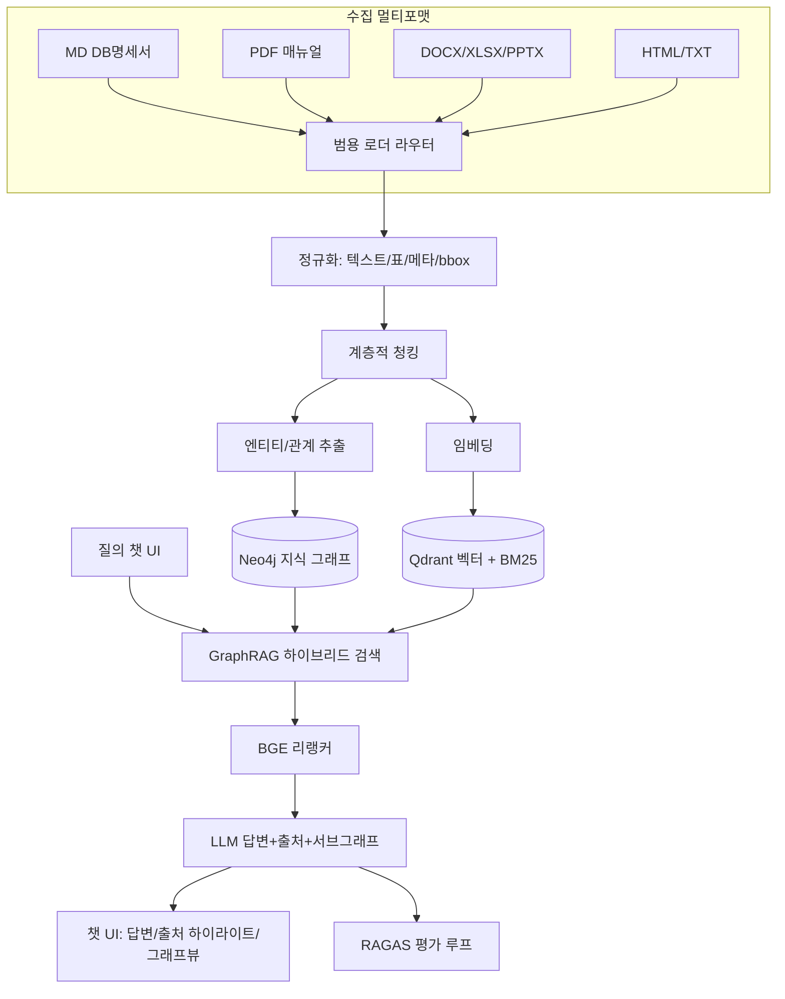

# 통합 GraphRAG 지식 관리 시스템 개발 계획서

> **1인 개발 · 8주(2026-06-22 ~ 2026-08-16) · AI 포트폴리오 + 실무 도구 겸용**
> **핵심 전략:** 완벽함이 아니라 **"질문 → 답변 → 출처 하이라이트 + 근거 서브그래프 관통 데모 + 정량 평가(RAGAS)로 증명"**

본 계획서는 다음 3개 개별 계획서를 하나의 일관된 시스템으로 통합한 마스터 플랜이다.

| 출처 계획서 | 통합 후 역할 |
| :--- | :--- |
| `마크다운_RAG_개발계획서.md` (DB 명세서 특화 RAG) | **데이터 소스 ①** — 마크다운 표(테이블 단위) 파이프라인 |
| `하이브리드_RAG_설비매뉴얼_지식관리시스템_개발계획서.md` | **데이터 소스 ② + 차별화** — PDF/OCR(bbox 보존), 하이브리드 검색, 출처 하이라이팅, RAGAS 평가 |
| `챗_UI_프론트엔드_개발계획서.md` | **프론트엔드** — ChatGPT/Gemini 스타일 챗 UI |

### 본 통합본의 2대 강화 결정
1. **GraphRAG 코어 채택** — 단순 벡터 검색이 아니라 **지식 그래프(엔티티·관계) 기반 멀티홉 추론**을 핵심으로. (벡터+BM25+그래프 하이브리드)
2. **멀티포맷 수집** — PDF만이 아니라 **MD / PDF / DOCX / XLSX / PPTX / HTML / TXT** 등 다양한 문서를 범용 로더로 탐색·인덱싱.

---

## 1. 통합 비전

하나의 GraphRAG 엔진으로 **다양한 포맷의 문서**를 수집하고, **지식 그래프 + 벡터 하이브리드**로 검색한다.

- **멀티포맷 수집:** 마크다운 DB 명세서, PDF 설비 매뉴얼, DOCX/XLSX/PPTX 보고서·표·슬라이드, HTML/TXT 등을 단일 파이프라인이 자동 분기 처리.
- **지식 그래프:** 문서에서 엔티티(테이블·컬럼·설비·부품·에러코드)와 관계(외래키, 설비-부품-에러코드)를 추출해 그래프 DB에 적재 → **멀티홉 질의**("이 에러코드와 연관된 부품의 점검 절차") 가능.
- **하이브리드 검색:** 벡터(의도) + BM25(코드/번호) + 그래프 traversal(관계)을 융합, 리랭커로 컨텍스트 선별.
- **출처 증명:** 답변마다 출처 표시·하이라이트(PDF는 bbox) + **근거 서브그래프 시각화**.
- **정량 평가:** RAGAS로 Hit Rate / MRR / 환각률 / 응답속도 측정·개선.



---

## 2. 통합 기술 스택 (택1 결정 완료 — 면접 방어용)

| 영역 | 선정 | 비고 / 통합 결정 사유 |
| :--- | :--- | :--- |
| RAG 엔진 | **LlamaIndex** (`PropertyGraphIndex`) | LangChain 병기 X. 그래프+벡터 인덱스 통합 지원, 멀티포맷 로더 풍부 |
| **그래프 DB** | **Neo4j** | LlamaIndex 통합 성숙, Cypher 멀티홉 traversal, 그래프 시각화 용이 |
| 벡터 DB | **Qdrant** | 메타데이터 필터(doc_type, table_name, bbox) 강력, 1인 PoC에 가벼움 |
| 키워드 검색 | **BM25** | 설비코드·에러번호·영문 컬럼명에 강함 |
| 리랭커 | **BGE-Reranker** | 벡터+그래프+BM25 결과 재정렬 |
| 임베딩 | **OpenAI text-embedding-3-small** | 약어/영문 컬럼명 시맨틱 포착 |
| **멀티포맷 로더** | **Unstructured** (MD/PDF/DOCX/XLSX/PPTX/HTML/TXT/EML/이미지) + **PyMuPDF**(PDF bbox 전용) | 포맷별 자동 분기, 표·도면 추출 |
| 엔티티/관계 추출 | **LLM 기반 추출**(LlamaIndex `SchemaLLMPathExtractor`) | 스키마 제약으로 환각 억제 |
| LLM | **Solar**(국산·한국어, 답변/추출) + **Claude**(DB명세서 코딩 컨텍스트 주입) | 용도 분리 |
| 백엔드 | **FastAPI** (Python), PostgreSQL | 세션/문서 메타 저장 |
| 프론트엔드 | **Next.js + TypeScript, Tailwind, shadcn/ui, PDF.js** | 챗 UI + 좌표 하이라이팅 |
| 그래프 시각화 | **react-force-graph** (또는 Cytoscape.js) | 근거 서브그래프 표시 |
| 스트리밍 | **SSE** | 토큰 단위 타이핑 |
| 평가 | **RAGAS / DeepEval** | Hit Rate, MRR, 환각률, 응답속도 |
| 인프라 | **Docker Compose** | FastAPI+Qdrant+Neo4j+PostgreSQL 일괄 기동 |

> **PoC 단축 옵션:** W5 백엔드 완성 전, 검색·그래프 품질 검증은 **Streamlit** 임시 UI + Neo4j Browser로 확인. 본 제품 UI는 Next.js로 W6부터.

---

## 3. 단계별 로드맵 (8주)

> 시작 2026-06-22(월). 주차 = 월~일. 각 주 끝 **검증 게이트(Gate)** 통과해야 다음 진입.

### W1 · 설계 + 멀티포맷/그래프/bbox PoC  (06/22 ~ 06/28)
- **목표:** 아키텍처 확정, 통합 메타데이터 + **그래프 스키마** 설계, 3대 PoC.
- 작업:
  - 통합 메타데이터 스키마: 공통(`doc_id`, `doc_type`, `source`, `score`) + MD(`table_name`, `logical_name`, `related_tables`) + PDF(`page`, `bbox`).
  - **그래프 스키마 설계:** 엔티티 타입(Table, Column, Equipment, Part, ErrorCode), 관계 타입(HAS_COLUMN, FK_TO, HAS_PART, CAUSES, FIXED_BY).
  - Docker Compose 골격(FastAPI + Qdrant + **Neo4j** + PostgreSQL).
  - **PoC ①** 멀티포맷: Unstructured로 MD/PDF/DOCX/XLSX 각 1개 → 텍스트/표 추출 검증.
  - **PoC ②** bbox: PyMuPDF로 PDF 1페이지 텍스트+bbox JSON 보존 검증.
  - **PoC ③** 그래프: 샘플 텍스트 → LLM 엔티티/관계 추출 → Neo4j 1건 적재.
- **🎯 Gate 1:** 4개 포맷 로딩 OK + bbox 보존 OK + Neo4j에 노드/엣지 1건 시각화 OK. 메타·그래프 스키마 확정.

### W2 · 멀티포맷 수집 파이프라인  (06/29 ~ 07/05)
- **목표:** 포맷별 자동 분기 로더 + 정규화 + 계층적 청킹 완성.
- 작업:
  - **로더 라우터:** 확장자/MIME로 분기(MD→테이블 파서, PDF→PyMuPDF+bbox, DOCX/XLSX/PPTX/HTML/TXT→Unstructured).
  - MD DB명세서: `### 테이블명` 단위 = **테이블 1개=1청크**, (1)임베딩 요약, (2)Claude용 압축 DDL, (3)메타 자동 생성. 약어 사전(`reg_dt`↔등록일자) 주입.
  - 공통 정규화 스키마로 통일(텍스트/표/메타/bbox), 계층적 청킹.
  - Qdrant 적재 + BM25 인덱스.
- **🎯 Gate 2:** 4종 이상 포맷이 동일 파이프라인으로 Qdrant 적재됨. MD 토큰절감(표 대비 DDL) 측정.

### W3 · 지식 그래프 구축  (07/06 ~ 07/12)  ⚠️ 함정 구간
- **목표:** 청크 → 엔티티/관계 추출 → Neo4j 그래프 완성 + PDF bbox 보존 적재.
- 작업:
  - `SchemaLLMPathExtractor`로 스키마 제약 엔티티/관계 추출(환각 억제).
  - MD: 외래키 → `FK_TO` 엣지. PDF: 설비-부품-에러코드 → `HAS_PART`/`CAUSES`/`FIXED_BY`.
  - **PDF bbox 좌표 메타 끝까지 전파**, 그래프 노드에 출처(doc_id/page/bbox/chunk_id) 역링크 저장.
  - Neo4j 적재 + 그래프-벡터 양방향 ID 연결.
- **리스크:** OCR/bbox + 관계추출 둘 다 과소추정 단골. 완벽주의 금지, 매뉴얼 1종·핵심 관계 타입만. 추출 품질 낮으면 룰기반 보강.
- **🎯 Gate 3:** "에러코드 E-12 → 연관 부품 → 점검절차" 멀티홉 Cypher 질의 동작. 노드에 출처 메타 보존 확인.

### W4 · GraphRAG 하이브리드 검색 + 관통 데모  (07/13 ~ 07/19)
- **목표:** 벡터+BM25+그래프 융합 검색, end-to-end 최초 연결.
- 작업:
  - 하이브리드 retriever: 벡터/BM25 top-k → 시드 노드 → **그래프 멀티홉 확장** → BGE 리랭커 선별.
  - 질의 타입 라우팅: 단순 사실(벡터 우선) vs 관계 추론(그래프 우선).
  - 관계 기반 연관 검색(MD 외래키로 엮인 테이블 묶음).
  - 프롬프트 + 환각 제어(출처 없는 답변 거부), 답변에 sources + **근거 서브그래프** 동봉.
- **🎯 Gate 4 (관통 데모):** Streamlit에서 멀티포맷 질문→답변→출처+서브그래프 end-to-end 동작.

### W5 · FastAPI 백엔드 API  (07/20 ~ 07/26)
- **목표:** GraphRAG 엔진을 REST/SSE API로 노출, 프론트 병렬개발 가능.
- 엔드포인트 계약:
  ```
  POST   /api/upload        # 멀티포맷 업로드 → 인덱싱 큐(로더 자동분기), job_id 반환
  GET    /api/documents     # 문서 목록 + 인덱싱 상태 + 포맷
  POST   /api/chat          # { query, session_id } → SSE 답변 + sources + subgraph
  GET    /api/graph         # 노드/엣지 조회(서브그래프 시각화용)
  GET    /api/sessions
  DELETE /api/sessions/:id
  ```
  ```json
  { "type": "token",    "content": "점검 절차는 ..." }
  { "type": "sources",  "data": [ { "doc_type":"pdf", "page":12, "bbox":[..], "score":0.92 } ] }
  { "type": "subgraph", "data": { "nodes":[..], "edges":[..] } }
  { "type": "done" }
  ```
- 비동기 인덱싱 큐(포맷 자동분기), PostgreSQL 세션/문서 메타.
- **🎯 Gate 5:** curl/Postman로 업로드→인덱싱→chat SSE(sources+subgraph) 정상.

### W6 · 프론트엔드 챗 UI  (07/27 ~ 08/02)
- **목표:** ChatGPT/Gemini 스타일 3분할 그리드 + 대화 흐름.
- 작업:
  - Next.js + Tailwind + shadcn/ui, 3분할 그리드(사이드바/대화/출처+그래프).
  - 채팅 말풍선, 멀티라인 입력(Enter 전송/Shift+Enter), 마크다운·DDL·코드 렌더 + 복사.
  - `/api/chat` SSE → 토큰 타이핑 효과.
- **🎯 Gate 6:** 브라우저 질문→스트리밍 답변→마크다운 렌더 정상.

### W7 · 출처 하이라이팅 + 그래프뷰 + 업로드/세션  (08/03 ~ 08/09)  ★ 핵심 차별화
- **목표:** bbox 하이라이팅 + **근거 서브그래프 시각화** + 업로드/세션 완성.
- 작업:
  - **PDF.js 스플릿 뷰:** 답변 근거 page 점프 + bbox 박스 하이라이트. MD는 테이블 카드 점프.
  - **그래프뷰:** react-force-graph로 답변 근거 서브그래프 표시, 노드 클릭→원문 출처 점프.
  - 멀티포맷 드래그앤드롭 업로드 + 인덱싱 진행률 폴링, 사이드바 문서 목록(포맷 뱃지).
  - 세션 저장·전환·삭제, 다크모드.
- **🎯 Gate 7:** 답변 클릭 → PDF bbox 하이라이트 + 서브그래프 노드 강조 동작.

### W8 · RAGAS 평가 + Docker + 안정화  (08/10 ~ 08/16)
- **목표:** 정량 평가 루프 + 패키징 + 포트폴리오 마감.
- 작업:
  - 평가셋(질문-정답-출처, 단순 + 멀티홉) 구축, **RAGAS/DeepEval로 Hit Rate, MRR, 환각률, 응답속도** 측정.
  - **벡터 RAG vs GraphRAG 비교 측정**(멀티홉 질의 정확도 향상폭 증명 = 차별화 핵심 수치).
  - 측정→개선(청킹/추출/리랭커/프롬프트)→재측정 1회전, **의사결정 로그** 문서화.
  - Docker Compose 전체 패키징, 멀티포맷 E2E QA.
  - README + 정량 지표 + 트레이드오프 로그.
- **🎯 Gate 8 (최종):** Docker 원클릭 기동, GraphRAG vs 벡터 비교 지표표, 관통 데모 영상/캡처.

---

## 4. 마일스톤 요약

| 주차 | 기간 | 단계 | 핵심 산출물 (Gate) |
| :--- | :--- | :--- | :--- |
| W1 | 06/22~06/28 | 설계+PoC | 메타·그래프 스키마, 멀티포맷·bbox·그래프 PoC |
| W2 | 06/29~07/05 | 멀티포맷 수집 | 로더 라우터 + 정규화 + Qdrant 적재 |
| W3 | 07/06~07/12 ⚠️ | 지식 그래프 | 엔티티/관계 추출 + Neo4j + bbox 보존 |
| W4 | 07/13~07/19 | GraphRAG 검색 | **관통 데모**(질문→답변→출처+서브그래프) |
| W5 | 07/20~07/26 | 백엔드 API | FastAPI+SSE(sources+subgraph) |
| W6 | 07/27~08/02 | 챗 UI | 스트리밍 대화 화면 |
| W7 | 08/03~08/09 ★ | 하이라이팅+그래프뷰 | bbox + 서브그래프 + 업로드/세션 |
| W8 | 08/10~08/16 | 평가+배포 | **GraphRAG vs 벡터 지표 + Docker + 마감** |

---

## 5. 리스크 관리

- **함정 구간 W3 (그래프 추출 + PDF bbox):** 둘 다 과소추정 단골 = 최대 리스크. 관계 타입·매뉴얼 범위 축소, 추출 품질 낮으면 룰기반 보강. 지연 시 멀티포맷 벡터 RAG로 데모 우선 확보 후 그래프 추가.
- **관통 우선 원칙:** 품질보다 W4 end-to-end 먼저. 깊이는 그 후.
- **1인 8주 미완성 리스크:** "다 구현" 금지. **MVP 관통 데모 + GraphRAG 비교 지표 + 의사결정 로그**가 "거대하지만 미완성"보다 우위.
- **GraphRAG 비용:** LLM 엔티티 추출 비용↑ → 대상 문서 수 제한, 추출 결과 캐싱.
- **병렬화:** W5 API 계약 확정 후 W6 프론트/백 병렬.
- **버퍼:** W8 후반 2~3일 안정화/문서 고정, 신규 기능 금지.

---

## 6. 포트폴리오 어필 포인트 (포스코DX 4년차 차별화)

1. **GraphRAG 멀티홉** — 단순 벡터 RAG 대비 관계 추론 정확도 향상폭을 **수치로 증명**(최신 기술을 측정으로 검증).
2. **멀티포맷 범용성** — MD/PDF/DOCX/XLSX/PPTX/HTML 단일 엔진 처리 → 실무 적용 범위 어필.
3. **정량 지표** — Hit Rate/MRR/환각률 측정→개선폭 → "구현자"가 아닌 "개선자".
4. **트레이드오프 로그** — "왜 Neo4j·Qdrant·LlamaIndex·이 청킹·BGE-Reranker?" 면접 질문 자판기.
5. **출처 좌표 하이라이팅 + 서브그래프** — 신뢰성 이중 시각 증명, 단순 PDF 챗봇과 결정적 차별선.
6. **MLOps 인상** — Docker(4-서비스) + RAGAS 평가 자동화로 "운영까지 본다".
